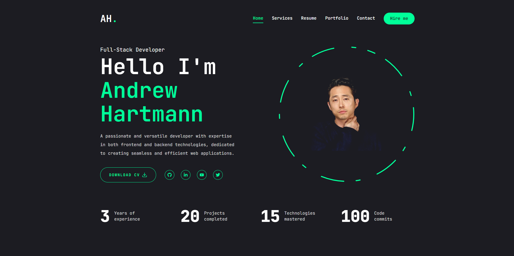

<div align="center">

# Reactfolio

[](https://opensource.org/licenses/MIT)


</div>

## Description

This project is a portfolio website built using Next.js, designed to showcase web development skills and projects. It features a single-page application (SPA) with sections for About Me, Portfolio, Contact, and Resume, demonstrating modern web technologies and design principles.

## Table of Contents

- [Description](#description)
- [Installation](#installation)
- [Usage](#usage)
- [Features](#features)
- [Contributing](#contributing)
- [Tests](#tests)
- [License](#license)

## Installation

1.  Clone the repository:

```bash
git clone https://github.com/haartmuhn/reactfolio.git
cd reactfolio
```

2.  Install the dependencies:

Ensure you have Node.js installed. Then, run:

```
npm install
```

## Usage

To run the React portfolio locally:

1.  Start the development server:

```bash
npm run dev
```

This will open the application in your default browser at `http://localhost:3000`.

2.  Build for production:

To create a production-ready build, run:

```bash
npm run build
```

3.  Start the production server:

To start the production server locally, run:

```bash
npm start
```

4.  Deploy To Netlify:

-   Go to Netlify and create an account if you don’t have one.
-   Click on "New site from Git" and connect your GitHub repository.
-   Follow the prompts to deploy your site.

The following image and video shows the web application's appearance and functionality: 

<div align="center">



[Visit my website](https://haartmuhn.netlify.app)

</div>

## Features

-   **Header:** Displays the developer's name and navigation links.
-   **Navigation:** Provides smooth scrolling to different sections of the portfolio.
-   **About Me Section:** Includes a recent photo/avatar and a brief bio.
-   **Portfolio Section:** Showcases six projects with links to their deployed versions and GitHub repositories.
-   **Contact Section:** Features a form for name, email, and message with validation.
-   **Resume Section:** Includes a downloadable resume and a list of proficiencies.
-   **Footer:** Contains links to GitHub, LinkedIn, and another profile (e.g., Stack Overflow or Twitter).

## Contributing

Contributions to Reactfolio are welcome! Here’s how you can contribute:

1. **Fork the repository** on GitHub.
2. **Create a branch** for your feature `git checkout -b new-feature`.
3. **Make changes** and commit them `git commit -m "Add some feature"`.
4. **Push to the branch** `git push origin new-feature`.
5. **Create a new Pull Request** against the main.

Please ensure your code adheres to the existing style of the project to make your changes easy to understand and integrate!

## Tests

To run tests, execute the following command:

```
npm test
```

(Note: You will need to write the tests based on the endpoints and operations your application performs, as this is not set up by default.)

## License

Reactfolio is licensed under the [MIT License](LICENSE). Feel free to use, modify, and distribute this application according to the terms of the license.